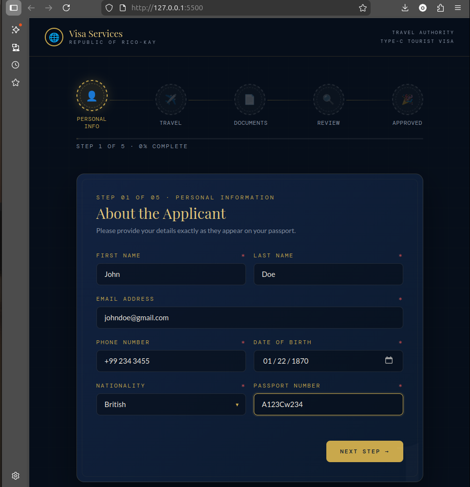

# Travel Visa Application — Republic of Rico-Kay

A multi-step travel visa application form built as a Frontend Mentor challenge solution. Features a passport-themed UI, animated stamp progress, drag & drop document upload, localStorage persistence, and a downloadable PDF approval certificate.

## Live Demo

[View Live →]https://travel-visa-application.vercel.app/ 

---

## Screenshot



---

## Features

- **5-step form flow** — Personal Info → Travel Details → Document Upload → Review → Approved
- **Passport stamp progress indicator** — stamps animate green as each step is completed
- **Smart duration field** — auto-calculates trip length from arrival and departure dates
- **Drag & drop document upload** — with strict file type enforcement (passport scan accepts PDF/JPG/PNG; photo accepts JPG/PNG only) and 5MB size limit
- **Step validation** — character-driven error messages that match the passport theme
- **Review step with inline editing** — jump back to any section directly from the summary
- **localStorage persistence** — progress is saved automatically; a "Continue" banner appears on return
- **Visa Approval Certificate** — dynamically populated with applicant's name, destination, and dates
- **PDF download** — certificate exports as a compressed JPEG-in-PDF, capped at 5MB
- **Fully responsive** — mobile-first layout, stamps adapt at small breakpoints

---

## Built With

- Semantic HTML5
- CSS custom properties (no framework)
- Vanilla JavaScript (no framework)
- [jsPDF](https://github.com/parallax/jsPDF) — PDF generation
- [html2canvas](https://html2canvas.hertzen.com/) — certificate rendering
- [Google Fonts](https://fonts.google.com/) — Playfair Display, IM Fell English, DM Mono, Lato

---

## Project Structure

```
travel-visa-application/
├── index.html      # App shell, HTML structure, certificate template
├── style.css       # All styles — variables, layout, components, animations
├── script.js       # All logic — state, validation, steps, PDF download
└── README.md
```

---

## Getting Started

No build tools or dependencies needed. Clone and open directly in a browser.

```bash
git clone https://github.com/RicoKay22/travel-visa-application.git
cd travel-visa-application
open index.html
```

Or drag `index.html` into any browser.

---

## Customisation

**Changing the republic name:** Edit the `.brand-text .sub` element in `index.html`. The certificate reads the name from the DOM at runtime — no changes needed in `script.js`.

**Adding destinations or nationalities:** Edit the `destinations()` and `nationalities()` arrays at the bottom of `script.js`.

---

## What I Learned

- Managing multi-step form state in plain JavaScript without a framework
- Enforcing file type validation beyond the `accept` attribute (MIME type checking in the handler)
- Using `html2canvas` + `jsPDF` with iterative JPEG compression to hit a target file size
- Reading values from the DOM into JavaScript constants to keep config in one place

---

## Author

- **Olumide Olayinka** — [@RicoKay22](https://github.com/RicoKay22)
- Frontend Mentor Profile — [@RicoKay22](https://www.frontendmentor.io/profile/RicoKay22)

---

## Acknowledgements

- Challenge structure inspired by [Frontend Mentor](https://www.frontendmentor.io)
- Fonts from [Google Fonts](https://fonts.google.com)
